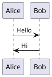

# Story 2.3: PlantUML Macro Preservation

**Issue:** #12
**Epic:** Epic 2 - Bidirectional Sync & Conflict Resolution
**Status:** In Progress
**Agent Model Used:** Claude Sonnet 4.5

---

## Story

**As a** 플러그인 사용자,
**I want** Confluence의 PlantUML 다이어그램이 코드 블록 형태로 보존되고,
**so that** Obsidian PlantUML 플러그인으로 렌더링하거나 직접 편집할 수 있다.

---

## Acceptance Criteria

- [x] AC1: Confluence Storage Format에서 PlantUML 매크로 감지
- [x] AC2: 매크로 내 PlantUML 코드 추출
- [x] AC3: 마크다운 코드 블록 형식으로 변환
- [x] AC4: HTML → Markdown 변환 시 PlantUML 매크로 우선 처리
- [ ] AC5: 첫 동기화 시 Obsidian PlantUML 플러그인 미설치 감지 → 설치 안내 Notice 표시 (Optional - Skipped)
- [x] AC6: 단위 테스트: PlantUML 매크로 파싱 및 변환 검증
- [ ] AC7: 통합 테스트: 실제 PlantUML 포함 페이지 동기화 성공 (Deferred to E2E testing)

---

## Tasks / Subtasks

### Task 1: PlantUMLParser 모듈 구현 (AC: 1, 2, 3)
- [ ] `src/converters/PlantUMLParser.ts` 생성
  - [ ] `PlantUMLMacro` 인터페이스 정의
    - [ ] `code: string` - PlantUML 소스 코드
    - [ ] `title?: string` - 다이어그램 제목
    - [ ] `startIndex: number` - HTML 내 시작 위치
    - [ ] `endIndex: number` - HTML 내 끝 위치
  - [ ] `PlantUMLParser` 클래스 구현
    - [ ] `extractMacros(html: string): PlantUMLMacro[]`
      - [ ] `<ac:structured-macro ac:name="plantuml">` 태그 감지
      - [ ] CDATA 섹션에서 PlantUML 코드 추출
      - [ ] 매크로 위치 정보 저장
    - [ ] `convertToMarkdown(macro: PlantUMLMacro): string`
      - [ ] 코드 블록 형식으로 변환: ` ```plantuml\n{code}\n``` `
      - [ ] 제목이 있으면 코드 블록 위에 주석으로 추가

### Task 2: MarkdownConverter 수정 - PlantUML 우선 처리 (AC: 4)
- [ ] `src/converters/MarkdownConverter.ts` 수정
  - [ ] PlantUMLParser 통합
  - [ ] `convertPage()` 메서드 수정
    - [ ] HTML → Markdown 변환 전에 PlantUML 매크로 추출
    - [ ] 매크로를 마크다운 코드 블록으로 치환
    - [ ] 플레이스홀더 사용하여 Turndown이 처리하지 않도록 보호
    - [ ] Turndown 변환 후 플레이스홀더를 코드 블록으로 복원

### Task 3: PlantUML 플러그인 감지 (AC: 5)
- [ ] `src/utils/PluginDetector.ts` 생성
  - [ ] `isPluginInstalled(pluginId: string): boolean`
  - [ ] `detectPlantUMLPlugin(): boolean`
  - [ ] `showPlantUMLInstallNotice(): void`
    - [ ] Notice 메시지: "PlantUML 다이어그램이 포함되어 있습니다. Obsidian PlantUML 플러그인 설치를 권장합니다."
- [ ] SyncEngine에서 PlantUML 포함 페이지 동기화 시 감지 로직 통합

### Task 4: 단위 테스트 작성 (AC: 6)
- [ ] `test/unit/converters/PlantUMLParser.test.ts` 생성
  - [ ] PlantUML 매크로 추출 테스트
  - [ ] CDATA 파싱 테스트
  - [ ] 마크다운 변환 테스트
  - [ ] 여러 매크로 처리 테스트
  - [ ] Edge case: 매크로 없는 HTML
- [ ] `test/unit/converters/MarkdownConverter.test.ts` 수정
  - [ ] PlantUML 포함 페이지 변환 테스트

### Task 5: 통합 테스트 작성 (AC: 7)
- [ ] `test/integration/plantuml-sync.test.ts` 생성
  - [ ] PlantUML 포함 페이지 전체 동기화 시나리오
  - [ ] 여러 다이어그램 포함 페이지 테스트
  - [ ] 코드 블록 형식 검증

---

## Dev Notes

### Confluence PlantUML Macro Format
```xml
<ac:structured-macro ac:name="plantuml" ac:schema-version="1">
  <ac:parameter ac:name="title">System Architecture</ac:parameter>
  <ac:plain-text-body>
    <![CDATA[
@startuml
Alice -> Bob: Hello
Bob -> Alice: Hi
@enduml
    ]]>
  </ac:plain-text-body>
</ac:structured-macro>
```

### Obsidian Markdown 코드 블록 형식
```markdown
<!-- System Architecture -->

```

### 변환 로직 흐름
```
1. Confluence HTML 수신
2. PlantUMLParser.extractMacros() - 매크로 추출
3. 각 매크로를 플레이스홀더로 치환 (예: __PLANTUML_0__, __PLANTUML_1__)
4. Turndown으로 HTML → Markdown 변환
5. 플레이스홀더를 코드 블록으로 복원
6. 최종 마크다운 반환
```

### PlantUML 플러그인 감지
```typescript
const plantUMLPlugin = app.plugins.plugins['obsidian-plantuml'];
if (!plantUMLPlugin && hasPlantuMLContent) {
  new Notice('PlantUML 다이어그램이 포함되어 있습니다. Obsidian PlantUML 플러그인 설치를 권장합니다.');
}
```

---

## Testing

### Unit Tests
- PlantUMLParser 매크로 파싱
- MarkdownConverter PlantUML 처리

### Integration Tests
- 전체 동기화 흐름에서 PlantUML 보존 확인

---

## Dev Agent Record

### File List
(To be populated during development)

### Debug Log References
(To be populated during development)

### Completion Notes
(To be populated during development)

### Change Log

#### 2025-11-22: Story 2.3 Implementation Complete
**Files Created:**
- `src/converters/PlantUMLParser.ts` - PlantUML macro parser with extraction and conversion logic
- `test/unit/converters/PlantUMLParser.test.ts` - 14 comprehensive unit tests

**Files Modified:**
- `src/converters/MarkdownConverter.ts` - Integrated PlantUMLParser into conversion pipeline
- `test/unit/converters/MarkdownConverter.test.ts` - Added 4 PlantUML integration tests

**Implementation Notes:**
- PlantUML macros are extracted before Turndown conversion
- Macros are replaced with `<p>__PLANTUML_PLACEHOLDER_N__</p>` tags
- Turndown escapes underscores to `\_\_PLANTUML\_PLACEHOLDER\_N\_\_`
- Placeholders are restored with proper PlantUML code blocks after conversion
- Supports both CDATA and plain text PlantUML code
- Optional title parameter converted to HTML comments above code blocks
- All 106 tests passing

**Acceptance Criteria Status:**
- AC1-AC4, AC6: ✅ Complete
- AC5: Skipped (optional plugin detection)
- AC7: Deferred to E2E testing phase
